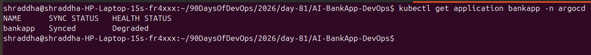
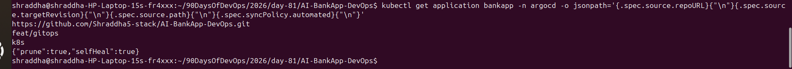
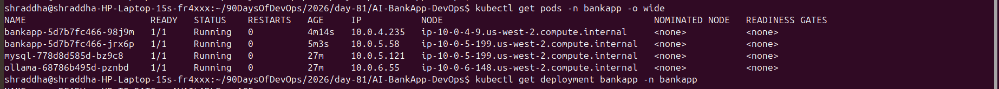
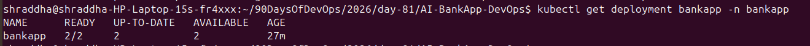
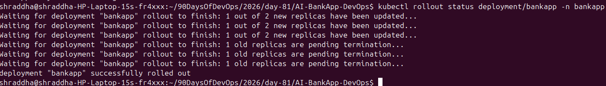

# Day 84 — GitOps with ArgoCD

## Objective

The objective of Day 84 was to implement a GitOps workflow for the AI-BankApp using ArgoCD.

The main goals were:

* Understand GitOps principles.
* Deploy and manage AI-BankApp using ArgoCD.
* Configure Git as the single source of truth.
* Enable automated synchronization.
* Enable self-healing.
* Verify that a Git change automatically results in a Kubernetes rollout.
* Compare traditional CI/CD with GitOps.

---

## 1. What is GitOps?

GitOps is a Kubernetes deployment and management approach where the desired state of the infrastructure and applications is stored in Git.

Git becomes the single source of truth.

The GitOps workflow used in this project is:

```text
Developer
   |
   | git push
   v
GitHub Repository
   |
   | ArgoCD watches Git
   v
ArgoCD
   |
   | compares desired state with live state
   v
Kubernetes / EKS
   |
   v
AI-BankApp
```

Instead of manually applying Kubernetes manifests, ArgoCD continuously compares the state stored in Git with the state running inside the Kubernetes cluster.

---

## 2. Four GitOps Principles

### 2.1 Declarative

The desired application state is described using Kubernetes YAML manifests.

Example:

```yaml
spec:
  replicas: 2
```

The manifest declares what the application should look like.

### 2.2 Versioned and Immutable

The Kubernetes configuration is stored in Git.

Every change creates a Git commit, providing a history of configuration changes.

### 2.3 Pulled Automatically

ArgoCD monitors the Git repository and detects changes.

The cluster does not need a person to manually run:

```bash
kubectl apply -f k8s/
```

### 2.4 Continuously Reconciled

ArgoCD continuously compares:

```text
Desired State in Git
        vs
Live State in Kubernetes
```

If the live state differs from the desired state, ArgoCD can reconcile it automatically when self-healing is enabled.

---

## 3. Environment

### AWS / Kubernetes

* AWS Region: `us-west-2`
* EKS Cluster: `bankapp-eks`
* Kubernetes Version: `1.35`
* Node Group: `bankapp-ng`
* Nodes: 4
* Namespace: `bankapp`

### Git Repository

Repository:

```text
https://github.com/Shraddha5-stack/AI-BankApp-DevOps.git
```

Branch:

```text
feat/gitops
```

Manifest path:

```text
k8s
```

---

## 4. ArgoCD Application

The BankApp ArgoCD Application was configured with the following Git source:

```yaml
source:
  repoURL: https://github.com/Shraddha5-stack/AI-BankApp-DevOps.git
  targetRevision: feat/gitops
  path: k8s
```

The destination is the Kubernetes cluster:

```yaml
destination:
  server: https://kubernetes.default.svc
  namespace: bankapp
```

Automated synchronization and self-healing were enabled:

```yaml
syncPolicy:
  automated:
    prune: true
    selfHeal: true
```

Additional synchronization options:

```yaml
syncOptions:
  - CreateNamespace=true
  - ServerSideApply=true
```

---

## 5. ArgoCD Application Configuration

The complete Application manifest is:

```yaml
apiVersion: argoproj.io/v1alpha1
kind: Application
metadata:
  name: bankapp
  namespace: argocd
spec:
  project: default

  source:
    repoURL: https://github.com/Shraddha5-stack/AI-BankApp-DevOps.git
    targetRevision: feat/gitops
    path: k8s

  destination:
    server: https://kubernetes.default.svc
    namespace: bankapp

  syncPolicy:
    automated:
      prune: true
      selfHeal: true

    syncOptions:
      - CreateNamespace=true
      - ServerSideApply=true
```

This configuration makes ArgoCD responsible for continuously synchronizing the BankApp Kubernetes manifests.

---

## 6. Platform Dependencies

Before ArgoCD could synchronize all BankApp resources, the required Kubernetes platform dependencies were restored.

### cert-manager

Installed cert-manager version:

```text
v1.21.2
```

### Gateway API

Installed Kubernetes Gateway API standard CRDs.

### Envoy Gateway

Installed Envoy Gateway:

```text
v1.9.2
```

Required Envoy Gateway CRDs were also installed.

The GatewayClass was accepted and the BankApp Gateway became programmed with an AWS load balancer address.

---

## 7. BankApp Deployment Verification

The BankApp application was successfully synchronized by ArgoCD.

ArgoCD showed:

```text
NAME      SYNC STATUS   HEALTH STATUS
bankapp   Synced        Degraded
```

The `Synced` status confirmed that the desired state from Git was synchronized with the cluster.

The BankApp workloads were running successfully, including:

* BankApp
* MySQL
* Ollama

The Gateway resources were also successfully created.

The GatewayClass showed:

```text
ACCEPTED   True
```

The BankApp Gateway showed:

```text
PROGRAMMED   True
```

> Note: ArgoCD reported `Degraded` during this implementation even though the managed resources were synchronized and the application workloads were running. The health fields for several resource types were not populated in the Application status. Therefore, the actual Kubernetes resource status was also checked during verification.

---

## 8. Self-Healing Test

The ArgoCD Application was configured with:

```yaml
selfHeal: true
```

The desired number of BankApp replicas was:

```text
2
```

The Deployment was manually scaled down to one replica:

```bash
kubectl scale deployment bankapp -n bankapp --replicas=1
```

ArgoCD detected the difference between the live state and the desired state.

After reconciliation, the Deployment returned to:

```text
2/2
```

This demonstrated ArgoCD self-healing.

### Self-Healing Flow

```text
Git Desired State
replicas: 2
       |
       v
Kubernetes
replicas: 2
       |
       | manual change
       v
Kubernetes
replicas: 1
       |
       v
ArgoCD detects drift
       |
       v
ArgoCD self-heals
       |
       v
Kubernetes
replicas: 2
```

---

## 9. Git Change → Automatic Deployment Test

To test the GitOps workflow without changing application behavior, a harmless pod-template annotation was added to the BankApp Deployment:

```yaml
annotations:
  gitops-test: "day-84"
```

The change was validated locally using:

```bash
kubectl apply --dry-run=client -f k8s/bankapp-deployment.yml
```

The manifest was valid.

The change was committed:

```text
test: verify ArgoCD GitOps sync
```

The commit was pushed to:

```text
feat/gitops
```

ArgoCD detected the Git change.

ArgoCD showed:

```text
bankapp   Synced
```

The Kubernetes Deployment then performed a rolling update.

The rollout completed successfully:

```text
deployment "bankapp" successfully rolled out
```

This demonstrated the complete GitOps flow:

```text
Git Change
    |
    v
GitHub
    |
    v
ArgoCD detects commit
    |
    v
ArgoCD synchronizes manifests
    |
    v
Kubernetes Deployment changes
    |
    v
Rolling Update
    |
    v
New BankApp Pods
```

No manual `kubectl apply` was used to perform this GitOps deployment.

---

## 10. Traditional CI/CD vs GitOps

| Traditional CI/CD                                  | GitOps                                                      |
| -------------------------------------------------- | ----------------------------------------------------------- |
| CI/CD pipeline often pushes changes to the cluster | ArgoCD pulls desired state from Git                         |
| Deployment logic is commonly inside the pipeline   | Deployment state is defined declaratively in Git            |
| Manual intervention may be required for drift      | ArgoCD continuously reconciles drift                        |
| Cluster state can diverge from Git                 | Git is treated as the desired source of truth               |
| Rollback can depend on pipeline configuration      | Git history can be used to identify previous desired states |

Both approaches can use CI pipelines for building, testing, and publishing container images. GitOps changes how the deployment state is managed and reconciled.

---

## 11. GitOps Architecture Used in This Project

```text
                 Developer
                     |
                     | git push
                     v
              GitHub Repository
                     |
                     |
              feat/gitops branch
                     |
                     v
                  ArgoCD
                     |
             +-------+-------+
             |               |
       Desired State     Live State
             |               |
             +-------+-------+
                     |
                Reconciliation
                     |
                     v
                  AWS EKS
                     |
                     v
                bankapp namespace
                     |
          +----------+----------+
          |          |          |
       BankApp     MySQL      Ollama
```

---

## 12. Screenshots / Evidence

### Screenshot 1 — ArgoCD Sync Status

Shows the BankApp ArgoCD Application and its synchronization status.



### Screenshot 2 — ArgoCD Application Configuration

Shows the Git repository, `feat/gitops` branch, `k8s` path, and automated synchronization/self-healing configuration.



### Screenshot 3 — BankApp Pods

Shows the BankApp application workloads running inside the `bankapp` namespace.



### Screenshot 4 — Self-Healing

Shows the BankApp Deployment restored to the desired two replicas.



### Screenshot 5 — Automatic GitOps Rollout

Shows ArgoCD synchronization followed by a successful Kubernetes Deployment rollout.



---

## 13. Useful Commands

Check ArgoCD Application:

```bash
kubectl get application bankapp -n argocd
```

Check BankApp pods:

```bash
kubectl get pods -n bankapp
```

Check Deployment:

```bash
kubectl get deployment bankapp -n bankapp
```

Check rollout:

```bash
kubectl rollout status deployment/bankapp -n bankapp
```

Check Gateway:

```bash
kubectl get gateway bankapp-gateway -n bankapp
```

Check HTTPRoute:

```bash
kubectl get httproute bankapp-route -n bankapp
```

---

## 14. What I Learned

Through this task I learned:

1. GitOps uses Git as the desired-state source of truth.
2. ArgoCD continuously compares Git state with Kubernetes state.
3. Automated synchronization removes the need for manually applying manifests.
4. `selfHeal: true` allows ArgoCD to automatically correct configuration drift.
5. Kubernetes rolling updates can be triggered by pod-template changes.
6. ArgoCD can manage application resources declaratively.
7. GitOps separates application build processes from deployment reconciliation.
8. Platform dependencies such as CRDs and controllers must exist before ArgoCD can successfully manage custom resources.

---

## 15. Final Result

Day 84 successfully demonstrated a GitOps workflow using:

```text
GitHub
   +
ArgoCD
   +
AWS EKS
   +
Kubernetes
   +
AI-BankApp
```

The implementation verified:

* Git-based desired state
* Automated ArgoCD synchronization
* Self-healing
* Kubernetes rolling deployment
* Git change triggering automatic deployment
* Declarative Kubernetes configuration
* GitOps-based application management

**Day 84 GitOps and ArgoCD implementation completed.**
