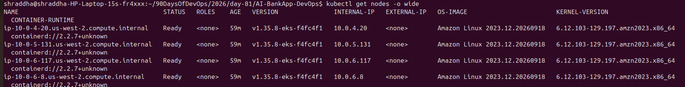
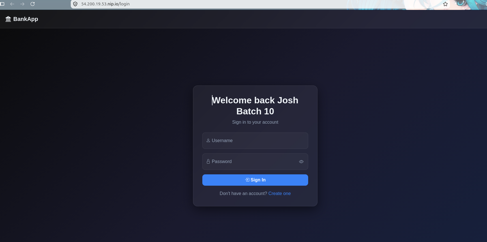
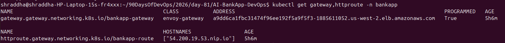
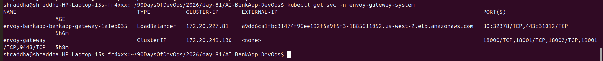
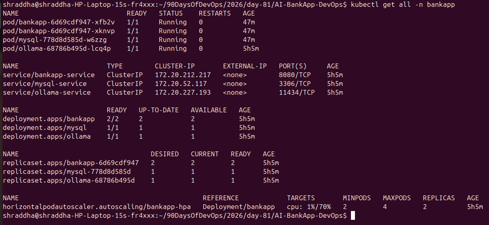

# Day 81 — Introduction to Amazon EKS with Terraform

## 1. Overview

This project demonstrates how to provision and operate an Amazon EKS cluster using Terraform and deploy an AI-powered BankApp using Kubernetes, Helm, Argo CD, Envoy Gateway, and AWS services.

### Technologies Used

- AWS EKS
- Terraform
- Kubernetes
- Docker
- Helm
- Argo CD
- Envoy Gateway
- AWS Load Balancer
- Amazon EBS
- MySQL
- Ollama
- Horizontal Pod Autoscaler (HPA)
- GitHub / GitOps

---

# 2. EKS Architecture

The EKS architecture consists of an AWS-managed Kubernetes control plane and customer-managed worker nodes.

```text
                         AWS CLOUD
                            |
                            v
                  +--------------------+
                  |    Amazon EKS      |
                  |  Managed Control   |
                  |      Plane         |
                  +--------------------+
                            |
              +-------------+-------------+
              |             |             |
              v             v             v
          API Server     Scheduler     Controllers
              |
              v
        +-----------------------------+
        |      EKS Worker Nodes       |
        |                             |
        |  +---------+  +----------+  |
        |  | BankApp |  |  MySQL   |  |
        |  |  Pods   |  |   Pod    |  |
        |  +---------+  +----------+  |
        |                             |
        |  +---------+                |
        |  | Ollama  |                |
        |  |   Pod   |                |
        |  +---------+                |
        +-----------------------------+
                     |
                     v
              Envoy Gateway
                     |
                     v
              AWS Load Balancer
                     |
                     v
              Internet / Browser
````

### EKS Components

**Control Plane**

AWS manages the Kubernetes control plane, including:

* Kubernetes API Server
* Scheduler
* Controller Manager
* etcd

**Data Plane**

The worker nodes run the actual application workloads.

In this project the worker nodes run:

* BankApp
* MySQL
* Ollama
* Kubernetes system workloads

---

# 3. Terraform Configuration

Terraform is used to provision the AWS infrastructure.

Important Terraform files include:

| File               | Purpose                                 |
| ------------------ | --------------------------------------- |
| `provider.tf`      | Configures AWS and Kubernetes providers |
| `variables.tf`     | Defines input variables                 |
| `terraform.tfvars` | Provides variable values                |
| `vpc.tf`           | Creates VPC, subnets and networking     |
| `eks.tf`           | Creates the EKS cluster and node groups |
| `argocd.tf`        | Configures Argo CD                      |
| `outputs.tf`       | Displays useful Terraform outputs       |

Terraform follows the workflow:

```text
Terraform Configuration
        |
        v
terraform init
        |
        v
terraform plan
        |
        v
terraform apply
        |
        v
AWS Infrastructure
        |
        v
EKS Cluster
```

---

# 4. EKS Cluster Provisioning

The EKS cluster was provisioned in:

```text
Region: us-west-2
Cluster: bankapp-eks
```

The cluster was verified using:

```bash
aws eks describe-cluster \
  --name bankapp-eks \
  --region us-west-2 \
  --query 'cluster.status'
```

The cluster status was:

```text
ACTIVE
```

---

# 5. Kubernetes Node Verification

The cluster currently contains four worker nodes.

Command used:

```bash
kubectl get nodes -o wide
```

All nodes were verified as:

```text
Ready
```



The worker nodes are running Amazon Linux 2023 and Kubernetes version `v1.35.8`.

---

# 6. Kubernetes Workloads

The BankApp namespace contains the main application workloads.

Command:

```bash
kubectl get all -n bankapp
```

The deployment contains:

* BankApp
* MySQL
* Ollama
* BankApp Service
* MySQL Service
* Ollama Service
* Horizontal Pod Autoscaler

The BankApp deployment currently runs two replicas.

```text
BankApp Pods
├── bankapp-6d69cdf947-xfb2v
└── bankapp-6d69cdf947-xknvp
```

Both pods are in the `Running` state.

---

# 7. BankApp Application

The BankApp is exposed through Kubernetes using:

```text
Service: bankapp-service
Port: 8080
Type: ClusterIP
```

The application was tested through the Envoy Gateway.

The root URL redirects to:

```text
/login
```

This `302 Found` response is expected because Spring Security redirects unauthenticated users to the login page.



The browser successfully displays the BankApp login page.

---

# 8. MySQL and Ollama

The BankApp uses MySQL for database functionality.

```text
mysql-service
Port: 3306
```

The project also runs Ollama:

```text
ollama-service
Port: 11434
```

Both workloads were verified as running in the `bankapp` namespace.

---

# 9. Persistent Volume

The project uses Kubernetes persistent storage for MySQL.

The PersistentVolumeClaim can be checked with:

```bash
kubectl get pvc -n bankapp
```

The storage is backed by AWS EBS through the Kubernetes storage configuration.


---

# 10. Horizontal Pod Autoscaler

The BankApp uses a Horizontal Pod Autoscaler.

Configuration:

```text
Minimum replicas: 2
Maximum replicas: 4
CPU target: 70%
```

The HPA can be checked using:

```bash
kubectl get hpa -n bankapp
```

Example:

```text
NAME          REFERENCE           TARGETS    MINPODS   MAXPODS   REPLICAS
bankapp-hpa   Deployment/bankapp  1%/70%     2         4         2
```

This allows Kubernetes to increase the number of BankApp pods when CPU utilization increases.

---

# 11. Envoy Gateway

Envoy Gateway is used as the Kubernetes Gateway API implementation.

The Gateway is:

```text
bankapp-gateway
```

The Gateway exposes HTTP and HTTPS listeners.

```text
Internet
    |
    v
AWS Load Balancer
    |
    v
Envoy Gateway
    |
    v
HTTPRoute
    |
    v
bankapp-service
    |
    v
BankApp Pods
```

Gateway status was verified as:

```text
Accepted=True
Programmed=True
```

The Gateway received an AWS Load Balancer address.

---

# 12. HTTPRoute

The application routing is configured using:

```text
bankapp-route
```

Hostname:

```text
54.200.19.53.nip.io
```

The HTTPRoute sends traffic to:

```text
bankapp-service:8080
```

The route uses:

```text
PathPrefix: /
```

The HTTPRoute was verified as:

```text
Accepted=True
ResolvedRefs=True
```



---

# 13. AWS Load Balancer

Envoy Gateway created an AWS Load Balancer.

Load Balancer hostname:

```text
a9dd6ca1fbc31474f96ee192f5a9f5f3-1885611052.us-west-2.elb.amazonaws.com
```

The service can be checked using:

```bash
kubectl get svc -n envoy-gateway-system
```

The LoadBalancer exposes:

```text
HTTP  : 80
HTTPS : 443
```



---

# 14. HTTPS Verification

The application was tested through HTTPS.

Example test:

```bash
curl -k -i \
  -H "Host: 54.200.19.53.nip.io" \
  "https://a9dd6ca1fbc31474f96ee192f5a9f5f3-1885611052.us-west-2.elb.amazonaws.com/"
```

The application returned:

```text
HTTP/2 302
location: https://54.200.19.53.nip.io/login
```

The redirect confirms that the request reached the BankApp and Spring Security redirected the unauthenticated request to `/login`.

The application was also opened successfully in a browser.

---

# 15. Argo CD GitOps

Argo CD is used to implement GitOps deployment.

Application:

```text
bankapp
```

Namespace:

```text
argocd
```

Repository:

```text
https://github.com/Shraddha5-stack/AI-BankApp-DevOps.git
```

Branch:

```text
feat/gitops
```

Path:

```text
k8s
```

Argo CD synchronization was configured with automated sync, pruning and self-healing.

The final Argo CD status was:

```text
Synced | Healthy
```



---

# 16. GitOps Workflow

The deployment workflow is:

```text
Developer
    |
    v
GitHub Repository
    |
    v
feat/gitops branch
    |
    v
Argo CD
    |
    v
Kubernetes Cluster
    |
    v
BankApp Deployment
```

When Kubernetes configuration is updated in Git, Argo CD detects the desired state and synchronizes the cluster.

---

# 17. Kubernetes Verification

Important verification commands used during the deployment:

### Nodes

```bash
kubectl get nodes -o wide
```

### BankApp workloads

```bash
kubectl get all -n bankapp
```

### Pods

```bash
kubectl get pods -n bankapp
```

### Services

```bash
kubectl get svc -n bankapp
```

### PVC

```bash
kubectl get pvc -n bankapp
```

### HPA

```bash
kubectl get hpa -n bankapp
```

### Gateway

```bash
kubectl get gateway -n bankapp
```

### HTTPRoute

```bash
kubectl get httproute -n bankapp
```

### Argo CD

```bash
kubectl get application bankapp -n argocd
```

---

# 18. Final Deployment Status

The final deployment was verified successfully.

| Component         | Status                  |
| ----------------- | ----------------------- |
| EKS Cluster       | Active                  |
| Worker Nodes      | 4 Ready                 |
| BankApp Pods      | 2 Running               |
| MySQL Pod         | Running                 |
| Ollama Pod        | Running                 |
| BankApp Service   | Available               |
| Gateway           | Accepted / Programmed   |
| HTTPRoute         | Accepted / ResolvedRefs |
| AWS Load Balancer | Available               |
| HTTPS             | Working                 |
| Argo CD           | Synced / Healthy        |
| HPA               | Active                  |

---

# 19. Screenshots

The project screenshots are stored in the `screenshots/` directory.

```text
screenshots/
├── 01-bankapp-login.png
├── 02-argocd.png
├── 03-kubernetes.png
├── 04-gateway-route.png
├── 05-envoy-loadbalancer.png
├── 06-kubectl-get-nodes-wide.png
```

---

# 20. Cost Considerations

AWS EKS and its supporting resources can generate charges.

Potential cost-producing resources include:

* Amazon EKS cluster
* EC2 worker nodes
* EBS volumes
* Load Balancer
* NAT Gateway
* Data transfer
* Other AWS resources created by Terraform

For cost control, resources should be destroyed when the project is no longer required.

Terraform cleanup:

```bash
terraform destroy
```

Before running destroy, verify that the correct AWS account, region and Terraform workspace are selected.

---

# 21. Cleanup

To remove the infrastructure:

```bash
terraform destroy
```

After cleanup, verify that unnecessary AWS resources such as:

* EKS cluster
* EC2 instances
* Load Balancers
* EBS volumes
* NAT Gateways

have been removed.

---

# 22. What I Learned

Through this project I learned how to:

1. Create an Amazon EKS cluster using Terraform.
2. Configure VPC networking for EKS.
3. Manage EKS worker nodes.
4. Deploy applications using Kubernetes.
5. Configure Kubernetes Services.
6. Configure persistent storage using PVCs.
7. Configure Horizontal Pod Autoscaling.
8. Deploy and manage workloads with Helm.
9. Use Argo CD for GitOps.
10. Configure Gateway API with Envoy Gateway.
11. Expose Kubernetes applications through an AWS Load Balancer.
12. Configure HTTP and HTTPS routing.
13. Debug Kubernetes networking and application issues.
14. Verify an end-to-end cloud-native application deployment.

---

# 23. Final Architecture

```text
                         GitHub
                           |
                           v
                    Argo CD / GitOps
                           |
                           v
                     Amazon EKS
                           |
        +------------------+------------------+
        |                  |                  |
        v                  v                  v
     BankApp              MySQL             Ollama
        |
        v
 bankapp-service
        |
        v
   HTTPRoute
        |
        v
 Envoy Gateway
        |
        v
 AWS Load Balancer
        |
        v
      HTTPS
        |
        v
     Browser
```

---

# 24. Conclusion

Day 81 successfully demonstrates an end-to-end DevOps workflow using Terraform, Amazon EKS, Kubernetes, Helm, Argo CD, Envoy Gateway and AWS networking.

The final BankApp deployment is running on EKS, the application is reachable through HTTPS, Kubernetes resources are healthy, and Argo CD reports the application as `Synced` and `Healthy`.

This project provides practical experience with infrastructure as code, container orchestration, GitOps, Kubernetes networking, persistent storage, autoscaling and AWS cloud infrastructure.

````
